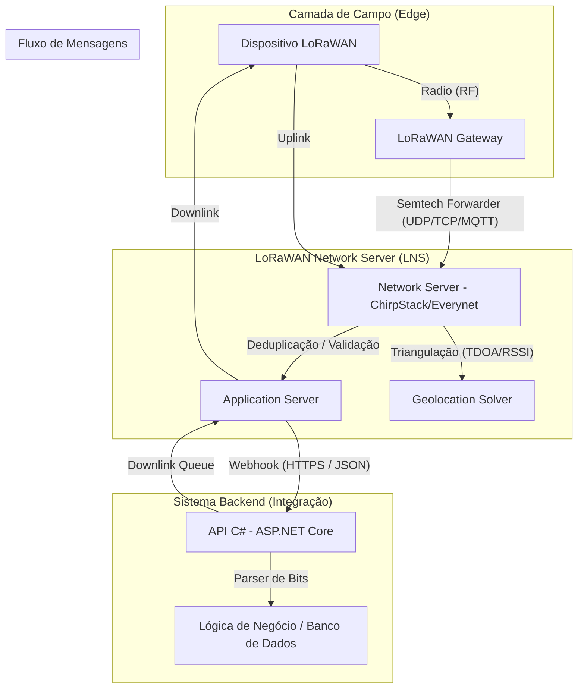

# Arquitetura de Software LoRaWAN: Do Dispositivo ao C#

Este documento descreve o fluxo de dados em uma rede LoRaWAN, desde a transmissão física do dispositivo até o processamento em um sistema backend desenvolvido em C# (.NET), utilizando como exemplo provedores como Everynet ou ChirpStack.

## 1. Diagrama de Arquitetura (Mermaid)



---

## 2. Tipos de Mensagens

### Uplink (Sobe)
- **O que é:** Mensagem enviada pelo dispositivo para o cloud.
- **Conteúdo:** Payload binário (sensores), metadados de rádio (RSSI, SNR), contador de frames (FCnt) e porta (FPort).
- **Frequência:** Geralmente definida por intervalo fixo ou gatilho de sensor.

### Downlink (Desce)
- **O que é:** Mensagem enviada do cloud para o dispositivo.
- **Conteúdo:** Comandos de configuração, mudança de estado de atuadores ou confirmações (ACK).
- **Nota:** Dispositivos LoRaWAN (Classe A) só recebem downlink imediatamente após enviar um uplink (janelas RX1 e RX2).

### Location / Geolocation
- **O que é:** Mensagem de metadados gerada pelo LNS contendo a estimativa de posição.
- **Triangulação:** Geralmente ocorre no **Application Server** ou em um **Geolocation Solver** externo.
    - **RSSI:** Baseado na força do sinal recebido por vários gateways (menos preciso).
    - **TDOA (Time Difference of Arrival):** Baseado na diferença de nanossegundos entre a chegada do sinal em gateways sincronizados com GPS (mais preciso).
- **Payload:** Contém Latitude, Longitude e Raio de Precisão.

---

## 3. O Payload do Dispositivo (Bits)

Um dispositivo LoRaWAN envia dados em formato binário para economizar bateria e banda. 

**Exemplo de Payload (6 bytes):** `01 02 0A 0B 00 FF`

| Offset | Tamanho | Dado | Representação |
| :--- | :--- | :--- | :--- |
| 0 | 1 byte | ID do Sensor | 0x01 |
| 1 | 2 bytes | Temperatura | 0x020A (Big Endian) |
| 3 | 2 bytes | Umidade | 0x0B00 |
| 5 | 1 byte | Status Bateria | 0xFF |

---

## 4. Como fazer o Parser no C#

No backend C#, você receberá um JSON do **Everynet** ou **ChirpStack**. O payload geralmente vem em Base64.

### Exemplo de Código C# para o Parser:

```csharp
using System;

public class LoRaPayloadParser
{
    public void ParsePayload(string base64Data)
    {
        // 1. Converter Base64 para Array de Bytes
        byte[] bytes = Convert.FromBase64String(base64Data);

        // 2. Extrair dados respeitando a ordem dos bits/bytes
        // Exemplo: 1º byte é o tipo, 2º e 3º são temperatura (short), etc.
        
        byte sensorId = bytes[0];
        
        // Exemplo de conversão Big Endian para Temperatura
        // Supondo que o dado seja um short de 16 bits
        short tempRaw = (short)((bytes[1] << 8) | bytes[2]);
        float temperature = tempRaw / 10.0f; 

        short humidityRaw = (short)((bytes[3] << 8) | bytes[4]);
        
        byte batteryStatus = bytes[5];

        Console.WriteLine($"Sensor ID: {sensorId}");
        Console.WriteLine($"Temperatura: {temperature}°C");
        Console.WriteLine($"Humidade: {humidityRaw}%");
        Console.WriteLine($"Bateria: {batteryStatus}");
    }
}
```

### Dicas para o Parser:
- **Endianness:** Verifique se o firmware do dispositivo envia em `Big-Endian` (C# BitConverter pode precisar de `Array.Reverse`).
- **Escalabilidade:** Use `Span<byte>` ou `BinaryReader` para payloads complexos e alta performance.
- **Porta (FPort):** Utilize o campo `FPort` do JSON para identificar o "contrato" de parsing, permitindo que o mesmo dispositivo envie diferentes tipos de mensagens.
