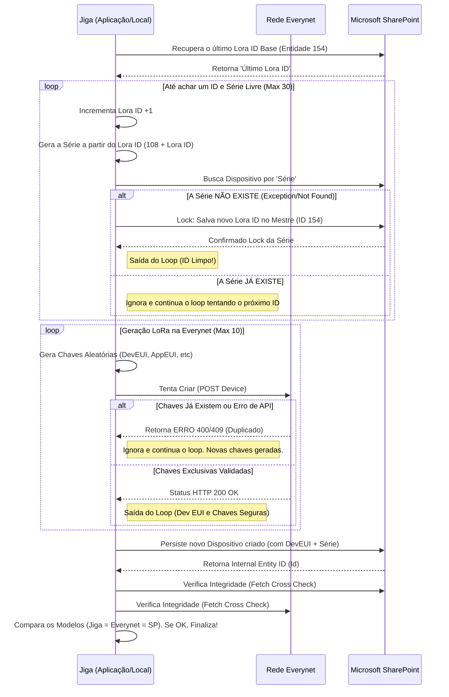

# Arquitetura de Integridade de Dados e Obtenção de IDs

Este documento descreve detalhadamente o fluxo atual em Python (utilizado na Jiga) de como as identificações exclusivas (Lora ID, Dev EUI e Série) são geradas e validadas sem duplicidade. Em seguida, apresenta-se como transpor essa mesma arquitetura para um ambiente **C# utilizando Vertical Slice Architecture (VSA) e Domain-Driven Design (DDD)**.

---

## 1. Como o ID da Entidade (Lora ID) é capturado atualmente

No código analisado, a geração da "Série" do hardware depende de um contador global salvo no SharePoint.

1. **Obtendo o ID Global (`sharepoint_ref_get`)**: O sistema procura no banco do SharePoint um item "Base/Mestre" (normalmente onde `N eq '0'`) para resgatar o último `LORA` convertido a partir do seu valor em texto salvo. 
2. **Atualizando o ID Global (`sharepoint_ref_update`)**: O ID centralizador é na verdade uma "Entidade" local com identificador fixo **154** no SharePoint (`db.get_item_by_id(154)`). Toda vez que um novo `Lora ID` é aprovado e bloqueado pela Jiga, este item de índice 154 é sobrescrito com a sua atualização.
3. **Capture da Nova Entidade do Dispositivo**: Quando o dispositivo é criado de fato chamando o método `add_item(iotag_dict)`, o processo de adição do SharePoint também retorna instanciado o `Item` com a respectiva propriedade inteira exclusiva da base Microsoft, o internal Entity ID (`Id`), que a aplicação assimila em tempo real: `iotag.sharepoint_id = item.properties.get("Id")`.

---

## 2. Diagrama de Fluxo e Prevenção de Colapso (Integridade)



---

## 3. Como Transportar para C# com VSA e DDD

Em **C#**, queremos dividir a responsabilidade para que fique limpo, testável e coeso. Uniremos conceitos de **Domain-Driven Design (DDD)** (regras ricas dentro do modelo de domínio das entidades e Serviços de Domínio) e **Vertical Slice Architecture (VSA)** (uma pasta/feature concentra toda comunicação da base ao endpoint).

### A. Estrutura de Pastas (VSA)

Na abordagem "Vertical Slice", fugimos do tradicional agrupamento por camadas técnicas (Repositories, Applications) genéricas. Separamos por **Feature**.

```text
/Features
    /Devices
        /ProvisionDevice
            ProvisionDeviceCommand.cs       (Input do Caso de Uso)
            ProvisionDeviceCommandHandler.cs (Lógica central, o "Handler")
            ProvisionDeviceEndpoint.cs      (Opcional, Controller ou Minimal API Route)
```

E no escopo global/compartilhado (DDD), temos as Entidades e Value Objects do Domínio.
```text
/Domain
    /Entities
        Device.cs          (Agregado Base)
    /ValueObjects
        LoraWANKeys.cs
        HardwareSeries.cs
    /Exceptions
        DataIntegrityConflictException.cs
```

---

### B. Implementação Base - Domain-Driven Design (DDD)

A entidade rica deve controlar a atualização e garantir a conformidade dos dados. As chaves farão parte de Value Objects.

```csharp
// Exemplo de Domínio em C# (Application.Domain.Entities)
namespace Application.Domain.Entities;

public class Device 
{
    public int EntitySharepointId { get; private set; } // Equivalente ao Sharepoint internal 'Id'
    public string SerialNumber { get; private set; } // "Série" do hardware
    public LoraWANKeys Keys { get; private set; } // Inclui Dev EUI, etc.

    // Apenas a Entidade tem permissão para assinar suas próprias chaves (Encapsulamento Rico)
    public void AssignIdentity(string serialNumber, LoraWANKeys keys)
    {
        if (string.IsNullOrWhiteSpace(serialNumber))
            throw new ArgumentException("A série não pode ser vazia.");
        
        SerialNumber = serialNumber;
        Keys = keys ?? throw new ArgumentNullException(nameof(keys));
    }

    // A Entidade não se 'salva' diretamente. É responsabilidade da Feature atualizar o EntitySharepointId 
    // após o retorno de um repositório, mas podemos prover o setter seguro.
    public void RegisterSharepointEntityIdentifier(int id) 
    {
        EntitySharepointId = id;
    }
}
```

---

### C. Handler (A Orquestração e Prevenção de Duplicidade - VSA)

No **Vertical Slice**, o **Handler** dessa feature orquestrará a mesma lógica que estava em Python: o *retry pattern* para garantir unicidade, usando um `for/while` manual com resiliência de tentativa. 

```csharp
// /Features/Devices/ProvisionDevice/ProvisionDeviceCommandHandler.cs
using Application.Domain.Entities;
using MediatR;

public class ProvisionDeviceCommand : IRequest<Device>
{
    public string HardwareVersion { get; set; }
    public string FirmwareVersion { get; set; }
}

public class ProvisionDeviceCommandHandler : IRequestHandler<ProvisionDeviceCommand, Device>
{
    // A Injeção de dependências para chamadas isoladas por Repositórios
    private readonly ISharepointRepository _sharepoint; 
    private readonly IEverynetApiClient _everynet;

    public ProvisionDeviceCommandHandler(ISharepointRepository sharepoint, IEverynetApiClient everynet)
    {
        _sharepoint = sharepoint;
        _everynet = everynet;
    }

    public async Task<Device> Handle(ProvisionDeviceCommand request, CancellationToken cancellationToken)
    {
        // 1. GERAR SÉRIE COM LOCK TRANSACTION (Evitar Duplicidade no SharePoint)
        var nextLoraId = await RequestUniqueSharepointLoraIdAsync();
        var hardwareSeries = $"108{(13000000 + nextLoraId)}";

        // 2. GERAR KEYS ÚNICAS EVERYNET (Prevenir Duplicação de Dev EUI na Web API)
        var loraKeys = await EnrollUniqueEverynetDeviceAsync(hardwareSeries);

        // 3. RECRIAR ENTIDADE DE DOMÍNIO
        var newDevice = new Device();
        newDevice.AssignIdentity(hardwareSeries, loraKeys); // Regra Central de Negócio.
        
        // 4. PERSISTIR NA BASE (E PEGAR O ENTITY ID EXTERNO)
        var sharepointEntityId = await _sharepoint.CreateDeviceAsync(newDevice);
        newDevice.RegisterSharepointEntityIdentifier(sharepointEntityId);
        
        // 5. CROSS-CHECK (Verificação de Integridade Rígida, espelhando o Python)
        await VerifyIntegrityOrThrowAsync(newDevice);

        return newDevice; // Fim do ciclo de Caso de Uso Vertical da Feature.
    }

    // --- Métodos Privados Auxiliares da Feature (Clean Code) ---

    private async Task<int> RequestUniqueSharepointLoraIdAsync()
    {
        int baseId = await _sharepoint.GetGlobalLoraCounterAsync(); // Item 'N eq 0'

        for (int i = 0; i < 30; i++)
        {
            baseId++;
            var serieToCheck = $"108{13000000 + baseId}";
            
            bool serieExists = await _sharepoint.DeviceSeriesExistsAsync(serieToCheck);
            
            // Se Não existir, confirmamos o Lock do número salvando no mestre isolado constante (ID: 154)
            if (!serieExists)
            {
                // Este método atua como o 'sharepoint_ref_update' do Python
                await _sharepoint.UpdateGlobalLoraCounterAsync(154, baseId);
                return baseId; 
            }
        }
        
        throw new DataIntegrityConflictException("Não foi possível gerar um Lora ID exclusivo em 30 iterações.");
    }

    private async Task<LoraWANKeys> EnrollUniqueEverynetDeviceAsync(string hardwareSeries)
    {
        for (int i = 0; i < 10; i++)
        {
            var keys = LoraWANKeys.GenerateRandomKeys();
            try
            {
                // Se o Dev EUI duplicar na nuvem do Everynet, isso jogará uma Exception HTTP
                await _everynet.PostDeviceAsync(hardwareSeries, keys);
                return keys; // Sucesso, chaves únicas registradas no provedor Lora!
            }
            catch (EverynetConflictException) 
            {
                await Task.Delay(500); // Tentar novamente com chaves limpas (Regenerar loop)
            }
        }

        throw new DataIntegrityConflictException("Provedor Everynet impossibilitado de gerar credenciais não duplicadas após 10 tentativas.");
    }

    private async Task VerifyIntegrityOrThrowAsync(Device device)
    {
        // Puxa as instancias recém geradas remotamente
        var cloudEverynet = await _everynet.GetDeviceByDevEuiAsync(device.Keys.DevEUI);
        var cloudSharepoint = await _sharepoint.GetDeviceBySeriesAsync(device.SerialNumber);

        // A checagem pode envolver implementações ricas de Equals no C#
        if (cloudEverynet.DevEui != cloudSharepoint.DevEui || cloudEverynet.HardwareSeries != device.SerialNumber)
            throw new DataIntegrityConflictException("Discrepância catastrófica no Cross-Check de Banco vs Lora WAN.");
    }
}
```
